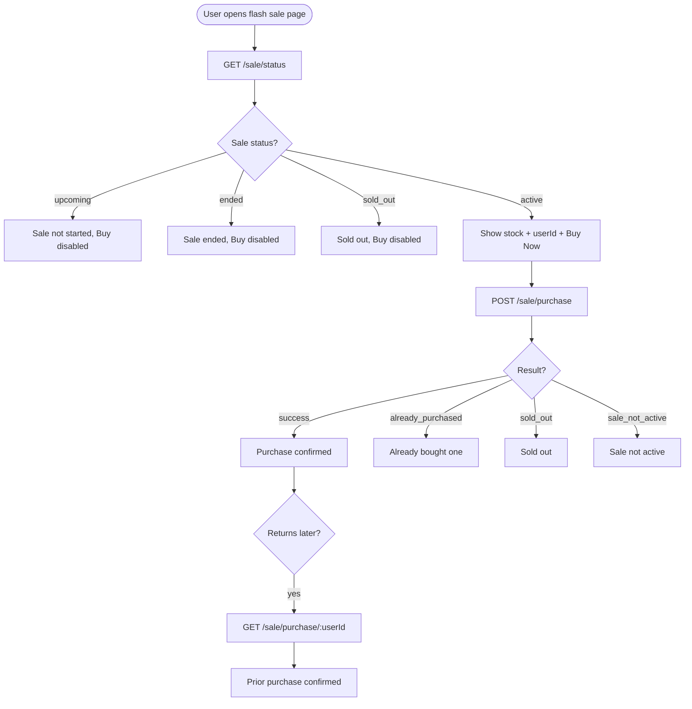
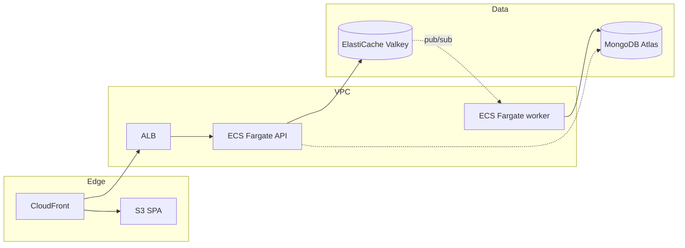
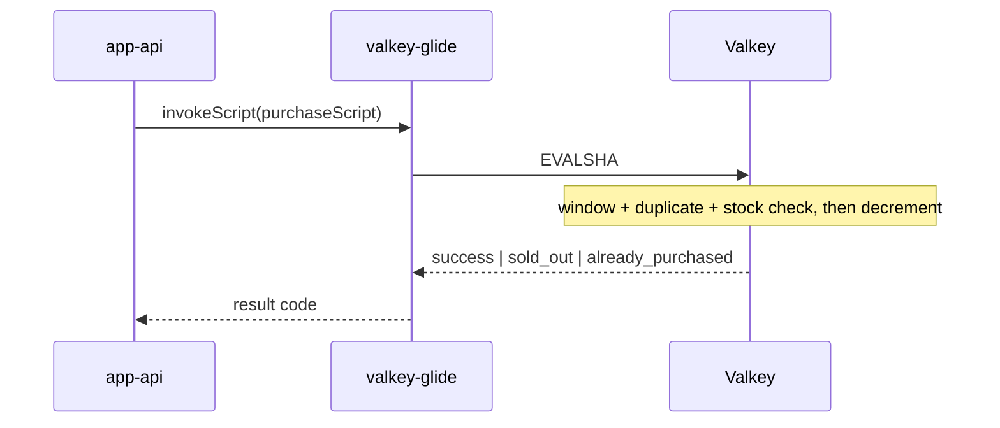

# Bookipi Flash Sale

**Core idea:** Valkey owns the purchase hot path through an atomic Lua script. MongoDB persists orders asynchronously, off the critical path.

## Contents

- [Prerequisites](#prerequisites)
- [Quick start](#quick-start-local-dev)
- [Running services](#running-services)
- [Docker](#docker)
- [Testing](#testing)
- [Environment variables](#environment-variables)
- [Project layout](#project-layout)
- [API endpoints](#api-endpoints)
- [Architecture](#architecture)
- [Design trade-offs](#design-trade-offs)
- [Evaluation criteria](#evaluation-criteria)
- [Stress test expectations](#stress-test-expectations)
- [Deployment notes](#deployment-notes)

## Prerequisites

| Tool | Version | Required for |
|------|---------|--------------|
| [Node.js](https://nodejs.org/) | **24.16.0** (`.nvmrc`) | API, web, tests |
| [Docker](https://www.docker.com/) | Latest | Valkey, MongoDB, integration tests, stress tests (k6) |
| npm | 11+ | Install and scripts |

Clone and install:

```bash
git clone https://github.com/ralphcasipe1/bookipi-flash-sale.git
cd bookipi-flash-sale
nvm use          # or: fnm use
npm install
```

## Quick start (local dev)

**Goal:** Run the full stack locally and complete a purchase in the web UI.

> [!IMPORTANT]
> Start Terminal 1 (`npm run docker:up`) before the API and web servers. Sale routes require Valkey and MongoDB.

Use three terminals: infra, API, and web.

```bash
# Terminal 1: Valkey (:6379) + MongoDB (:27017)
npm run docker:up

# Terminal 2: API (:3000) with an active sale seeded on startup
SALE_START=2026-06-08T00:00:00.000Z \
SALE_END=2026-12-31T23:59:59.000Z \
INITIAL_STOCK=100 \
VALKEY_URL=redis://localhost:6379 \
MONGODB_URL=mongodb://localhost:27017/flash_sale \
npm run dev -w @flash-sale/api

# Terminal 3: React dev server (:5173), proxies /sale → API
npm run dev -w @flash-sale/web
```

| What | URL |
|------|-----|
| Web UI | http://localhost:5173 |
| API health | http://localhost:3000/health |
| Swagger docs | http://localhost:3000/docs |
| Sale status | http://localhost:3000/sale/status |

**Verify:** Open the web UI, enter an email or username, and click **Buy now**. You should see a purchase confirmation.

Stop infra when done: `npm run docker:down`

## Running services

### All at once (Turbo)

Starts API and web dev servers together. Docker infra must already be running.

```bash
npm run docker:up
npm run dev
```

### API only

```bash
npm run docker:up

# Minimal: health check only
npm run dev -w @flash-sale/api

# Full stack: Valkey inventory + MongoDB order persistence
VALKEY_URL=redis://localhost:6379 \
MONGODB_URL=mongodb://localhost:27017/flash_sale \
SALE_START=2026-06-08T00:00:00.000Z \
SALE_END=2026-12-31T23:59:59.000Z \
INITIAL_STOCK=100 \
npm run dev -w @flash-sale/api
```

> [!NOTE]
> The minimal API command exposes `/health` only. Set `VALKEY_URL` (and sale seed vars) to enable `/sale/*` routes.

Production build:

```bash
npm run build -w @flash-sale/shared && npm run build -w @flash-sale/api
VALKEY_URL=redis://localhost:6379 npm run start -w @flash-sale/api
```

### Web only

Requires a running API. Vite proxies `/sale` to `localhost:3000`.

```bash
npm run dev -w @flash-sale/web
```

Preview production build:

```bash
npm run build -w @flash-sale/web
npm run preview -w @flash-sale/web
```

### Order worker (async MongoDB writes)

Runs separately from the API. Subscribes to Valkey pub/sub and persists orders.

```bash
npm run docker:up

VALKEY_URL=redis://localhost:6379 \
MONGODB_URL=mongodb://localhost:27017/flash_sale \
npm run dev:worker -w @flash-sale/api
```

> [!TIP]
> When the worker runs in its own process, disable the in-process subscriber on the API:
>
> ```bash
> ORDER_WORKER_IN_PROCESS=false npm run dev -w @flash-sale/api
> ```

## Docker

### Infra only (default)

Valkey and MongoDB. Use with local `npm run dev` for hot reload.

```bash
npm run docker:up
npm run docker:down
```

### Full stack (containers)

Builds and runs **api**, **worker**, and **web** via Compose profile `app`:

```bash
npm run docker:up:app
```

| Service | URL |
|---------|-----|
| Web (nginx) | http://localhost:8080 |
| API | http://localhost:3000 |

Individual image builds:

```bash
npm run docker:build:api
npm run docker:build:worker
npm run docker:build:web
```

### MongoDB on Linux kernel 6.19+

> [!WARNING]
> MongoDB may exit immediately on OrbStack or Linux kernel 6.19+. The compose files already set `GLIBC_TUNABLES=glibc.pthread.rseq=1`. See [docker-library/mongo#748](https://github.com/docker-library/mongo/discussions/748).

## Testing

### Unit tests (no Docker)

Tests pure domain logic. Runs in milliseconds.

```bash
npm run test:unit
# or scoped:
npm run test:unit -w @flash-sale/api
```

### Integration tests (Docker required)

Uses isolated ports via `docker-compose.test.yml` (Valkey **6380**, MongoDB **27018**).

```bash
docker compose -f docker-compose.test.yml up -d --wait

VALKEY_URL=redis://localhost:6380 \
MONGODB_URL=mongodb://localhost:27018/flash_sale \
npm run test:integration -w @flash-sale/api

docker compose -f docker-compose.test.yml down
```

CI runs the same flow automatically on push and PR.

### Stress test (k6)

> [!IMPORTANT]
> The stress test passes only when successes equal `INITIAL_STOCK`. k6 also fails on duplicate buyer wins or p99 above 500 ms.

**Prerequisites:** Valkey running, API on port 3000, Docker (k6 runs in a container via `npm run test:stress`).

```bash
# Terminal 1: API (MongoDB optional; purchase hot path is Valkey)
npm run docker:up
VALKEY_URL=redis://localhost:6379 npm run dev -w @flash-sale/api

# Terminal 2: reset inventory, then load test
INITIAL_STOCK=100 VALKEY_URL=redis://localhost:6379 npm run stress:reset -w @flash-sale/api

API_URL=http://localhost:3000 INITIAL_STOCK=100 npm run test:stress -w @flash-sale/api
```

| Variable | Default | Purpose |
|----------|---------|---------|
| `API_URL` | `http://localhost:3000` | Target API |
| `INITIAL_STOCK` | `100` | Expected success count (must match seeded stock) |
| `STRESS_VUS` | `500` | Virtual users |
| `STRESS_ITERATIONS` | `500` | Total purchase attempts (one per user) |

**Sample output:**

```
Flash sale stress summary
Initial stock (expected successes): 100
Actual successes:                   100
Sold out responses:                 400
Already purchased responses:        0
Sale not active responses:          0
Oversell check:                     PASS
Request rate (RPS):                 847.3
p95 latency (ms):                   12.4
p99 latency (ms):                   28.6
```

See [Stress test expectations](#stress-test-expectations) for sample output and full pass criteria.

`npm run test:stress` runs [k6](https://k6.io/) in Docker (`grafana/k6`). `API_URL` defaults to `http://localhost:3000` and is rewritten to `host.docker.internal` inside the container.

### All quality checks

```bash
npm run lint
npm run format:check
npm run types:check
npm run build
npm run test:unit
npm run test:integration   # requires test Docker infra
npm run test:stress        # requires Docker + running API
```

## Environment variables

| Variable | Default | Used by | Purpose |
|----------|---------|---------|---------|
| `VALKEY_URL` | `redis://localhost:6379` | API, worker, stress | Valkey connection |
| `MONGODB_URL` | (none) | API, worker | MongoDB connection (optional for API dev) |
| `SALE_START` | (none) | API | ISO timestamp, sale window start |
| `SALE_END` | (none) | API | ISO timestamp, sale window end |
| `INITIAL_STOCK` | (none) | API, stress | Items available at sale start |
| `ORDER_WORKER_IN_PROCESS` | `true` | API | Set `false` when running standalone worker |
| `PORT` | `3000` | API | HTTP port |
| `VITE_API_BASE_URL` | `""` | Web | API base URL (empty = relative, uses Vite proxy) |

The API seeds the sale on startup when `VALKEY_URL`, `SALE_START`, `SALE_END`, and `INITIAL_STOCK` are all set. For stress tests, run `npm run stress:reset` to re-seed without restarting the API.

## Project layout

```
app-api/              Fastify server (@flash-sale/api)
  src/domain/         Pure business rules (unit tested)
  src/infrastructure/ Valkey Lua inventory, MongoDB orders
  src/routes/         HTTP endpoints
  stress/             k6 load test + sale reset helper
  __tests__/          Integration tests (Vitest + Docker)
app-web/              React 19 + Vite + UnoCSS (@flash-sale/web)
package-shared/       Zod schemas + shared types (@flash-sale/shared)
package-config/       Shared tsconfig
docker-compose.yml    Valkey + MongoDB (dev)
docker-compose.test.yml  Isolated ports for CI/local integration tests
Dockerfile            Multi-stage targets: api | worker | web
```

## API endpoints

| Method | Path | Description |
|--------|------|-------------|
| `GET` | `/health` | Health check |
| `GET` | `/sale/status` | Sale status and remaining stock |
| `POST` | `/sale/purchase` | Attempt purchase `{ userId }` |
| `GET` | `/sale/purchase/:userId` | Lookup prior purchase |
| `GET` | `/docs` | Swagger UI |

## Architecture

### User journey



Rules enforced end-to-end:

- **One item per user:** duplicate attempts return `already_purchased`
- **Limited stock:** when stock hits zero, status becomes `sold_out`
- **Sale window:** purchases only while status is `active`

### Local architecture

What runs in this repo via Docker Compose and local dev servers:

```mermaid
flowchart LR
  subgraph client [app-web]
    UI[React UI]
  end

  subgraph compute [app-api]
    API[Fastify API]
    Worker[Order worker]
  end

  subgraph data [Docker Compose]
    Valkey[(Valkey)]
    Mongo[(MongoDB)]
  end

  UI -->|HTTP| API
  API -->|invokeScript (hot path)| Valkey
  API -->|publish flash:orders| Valkey
  Valkey -->|pub/sub| Worker
  Worker -->|async insertOne| Mongo
  API -.->|purchase lookup| Mongo
```

**Purchase hot path** (single round-trip to Valkey):

1. Sale window is active
2. User has not already purchased
3. Stock is greater than zero
4. Atomically decrement stock and record the buyer

**Async path:** on success, the API publishes an order event. The worker (in-process for local dev, or a separate container via `--profile app`) writes to MongoDB. Purchases still succeed if MongoDB is temporarily down; durability is eventual.

### AWS production target

> [!NOTE]
> This diagram describes the intended AWS deployment. Cloud resources are not provisioned in this take-home.



| Path | Route | Purpose |
|------|-------|---------|
| Static assets | Browser → CloudFront → S3 | React SPA |
| API | Browser → CloudFront → ALB → ECS | `/sale/*` endpoints |

Scaling levers: horizontal ECS tasks behind ALB, ElastiCache Valkey cluster for inventory, worker tasks scaled independently for order writes, CloudFront for static traffic.

### Why a Lua script?

Concurrent `GET stock` and `DECR` as separate commands can oversell under load. The purchase script bundles **read → validate → write** into one atomic server-side operation.

| Approach | Flash sale? | Why |
|----------|-------------|-----|
| Glide `Batch` only | No | Cannot branch on live state (window, duplicate user, stock) |
| WATCH + retry in Node | Fragile | Extra round trips; retry storms under contention |
| **Lua via `invokeScript`** | **Yes** | Conditional check-and-set in one atomic step; EVALSHA cached by Glide |



Implementation: `app-api/src/infrastructure/valkey/purchase.script.lua`

## Design trade-offs

| Decision | Choice | Trade-off |
|----------|--------|-----------|
| Hot-path inventory | Valkey + Lua | Fast and atomic; Valkey is the source of truth during the sale |
| Durable orders | MongoDB async via pub/sub | Lower purchase latency; eventual consistency until worker writes |
| Idempotency | Unique index on `userId` | Duplicate pub/sub deliveries are safe; no double-charge in audit trail |
| Auth | Skipped (userId string) | Out of assessment scope; would add JWT/session in production |
| ODM | None (`@fastify/mongodb`) | Native driver, less magic; more explicit queries |
| Shared contracts | Zod in `package-shared` | Single schema for API validation and web types |
| Local worker | In-process subscriber default | Simpler dev loop; compose `worker` service mirrors ECS split |
| Pub/sub vs queue | Valkey pub/sub | Simpler for take-home; production would use SQS + DLQ for stronger delivery |

### Failure modes

| Failure | Behaviour |
|---------|-----------|
| Valkey down | **Fail closed:** no purchases (inventory unavailable) |
| MongoDB down | Purchases still succeed; orders queue until worker retries |
| API task crash | In-flight request may fail; no oversell once Valkey confirms |
| Worker crash | Messages remain in pub/sub; new worker resumes with idempotent writes |

## Evaluation criteria

How this submission maps to the assessment rubric:

| Criterion | Demonstrated by |
|-----------|-----------------|
| **System design** | Local and AWS diagrams; Valkey hot path; async MongoDB; Lua rationale |
| **Code quality** | Flat monorepo; domain separated from infra; shared Zod schemas; incremental phases |
| **Correctness** | Lua atomic purchase; unique `userId` index; integration and k6 prove no oversell |
| **Testing** | Vitest unit (`*.spec.ts`) and integration (`__tests__/`); parallel concurrency test; k6 stress |
| **Pragmatism** | Local Docker, no cloud deploy; documented production story; auth/payment deferred |

**Proof points for the interview:**

1. *"Valkey owns the hot path; MongoDB is async and off the critical path."*
2. *"Lua makes purchase atomic; k6 shows successes never exceed initial stock."*
3. *"Unit tests for domain logic; integration tests hit real Valkey/MongoDB."*

## Stress test expectations

With `INITIAL_STOCK=100` and `STRESS_ITERATIONS=500` (500 unique buyers, 100 items):

| Metric | Expected |
|--------|----------|
| Successes | **Exactly 100** (= initial stock) |
| Sold out | ~400 |
| Already purchased | 0 (unique userIds) |
| Oversell check | PASS |
| p99 latency | Under 500 ms threshold (local Mac varies) |

Example from a local run (100 VUs, 100 stock, all succeed):

```
Actual successes:     100
Oversell check:     PASS
p95 latency (ms):   ~36
```

Higher concurrency (500 VUs vs 100 stock) produces ~400 `sold_out` responses. The important invariant is **successes === INITIAL_STOCK**, not total throughput alone.

Local bottlenecks: single Valkey thread, Node event loop, no horizontal scaling. On AWS, ECS auto-scaling and ElastiCache cluster mode address API and HA; Valkey remains the contention point by design.

Run instructions: [Stress test (k6)](#stress-test-k6)

## Deployment notes

### Docker multi-stage targets

One `Dockerfile`, three entrypoints. Mirrors ECS task definitions:

| Target | CMD | Purpose |
|--------|-----|---------|
| `api` | `node dist/index.js` | HTTP server |
| `worker` | `node dist/worker.js` | Order persistence subscriber |
| `web` | nginx | Static SPA + `/sale/` proxy |

```bash
docker build --target api -t flash-sale-api .
docker build --target worker -t flash-sale-worker .
docker build --target web -t flash-sale-web .
```

In ECS Fargate, the same ECR image artifact deploys as separate services with different `command` overrides. API tasks handle HTTP, worker tasks handle pub/sub consumption, independently scalable.

### CI

GitHub Actions runs lint, format, typecheck, build, unit tests, and integration tests (with `docker-compose.test.yml`) on every push and PR to `main`.
